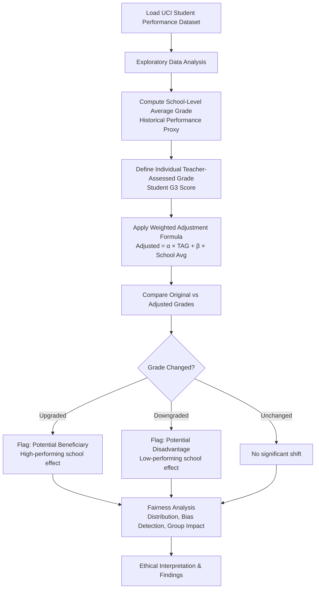

# UK A-Level Algorithm — Fairness Simulation & AI Ethics Case Study

> An educational exploration of algorithmic bias, fairness, and responsible AI through the lens of the 2020 UK A-Level grading controversy.

---

## Overview

In 2020, the UK's exam regulator Ofqual deployed an algorithm to moderate student grades after COVID-19 forced the cancellation of A-Level examinations. The algorithm incorporated historical school performance data as one of its inputs,  and the results drew widespread criticism for appearing to disadvantage students from historically lower-performing schools, regardless of those students' individual potential.

This project has two parts:

- **A structured case study** examining the ethical, governance, and social dimensions of the controversy.
- **A fairness simulation notebook** built on the UCI Student Performance Dataset(https://archive.ics.uci.edu/dataset/320/student+performance), which demonstrates how group-level historical data can meaningfully shift individual student outcomes.

The goal isn't to reproduce the Ofqual algorithm. It's to understand *why* certain design choices in algorithmic systems raise fairness concerns, and what better practices might look like.

---

## Background: The UK A-Level Controversy

When A-Level exams were cancelled in May 2020, Ofqual introduced a Statistical Standardisation Model to replace teacher-assessed grades (TAGs) with moderated scores. The model factored in a school's historical grade distribution to "standardise" outcomes nationally.

The consequences were significant:

- Around **40% of teacher-assessed grades were downgraded** by the algorithm.
- Students from smaller schools or those with limited historical data were disproportionately assessed based on their school's track record rather than their own work.
- Critics noted that students from lower-performing schools,  often in more deprived areas, were more likely to receive lower moderated grades compared to peers at historically high-performing institutions.
- The UK government reversed the decision within days, reinstating teacher-assessed grades after public backlash.

This episode became a widely cited example of how algorithmic systems, even when built with good intentions, can produce unfair outcomes at scale, and how the absence of adequate transparency and human oversight compounds the damage.

---

## Problem Statement

The central question this project explores:

> **When historical group-level data is used to inform individual outcomes, who benefits and who doesn't?**

Specifically, this project investigates:

- How a school's average historical performance can pull individual student grades up or down.
- Which types of students are most exposed to downward adjustment in such a system?
- What fairness metrics can tell us about the distribution of those impacts.
- What this implies for how algorithmic systems should be designed, audited, and governed.

---
## Project Components

| Component                   | Description                                                                                                                                  |
| --------------------------- | -------------------------------------------------------------------------------------------------------------------------------------------- |
| `Fairness_Simulation.ipynb` | Jupyter Notebook containing the fairness simulation, data exploration, grade adjustment mechanism, and analysis.                             |
| `AI-Ethics-Case-Study-Report.pdf`  | Research report discussing the UK A-Level Algorithm controversy, ethical concerns, governance challenges, and responsible AI considerations. |

Together, these components provide both a conceptual and practical perspective on algorithmic fairness in educational decision-making.

## Simulation Workflow



---

## Tech Stack

| Tool | Purpose |
|---|---|
| Python 3.x | Core language |
| Pandas | Data loading, manipulation, aggregation |
| NumPy | Numerical operations |
| Matplotlib | Visualisations |
| Seaborn | Distribution and comparison plots |
| Jupyter Notebook | Interactive analysis environment |

No ML models are used. The simulation relies entirely on a deterministic adjustment formula, which is a deliberate choice to keep the mechanism transparent and inspectable.

---

## Dataset Information

**Dataset:** UCI Student Performance Dataset
**Source:** [https://archive.ics.uci.edu/dataset/320/student+performance](https://archive.ics.uci.edu/dataset/320/student+performance)
**Subset used:** Math performance (`student-mat.csv`)

| Feature | Role in Simulation |
|---|---|
| `G3` | Final grade — used as proxy for teacher-assessed grade |
| `school` | School identifier — used to compute historical average |
| `G1`, `G2` | Earlier period grades which are used in EDA |
| Demographic columns | Used for fairness analysis across subgroups |

The dataset contains records for **395 students** across two schools (Gabriel Pereira and Mousinho da Silveira). While small, the dataset is sufficient to demonstrate the core dynamics of school-level adjustment.

---

## Fairness Simulation Methodology


The simulation here uses  a simplified linear blending formula:

```
Adjusted Grade = α × (Student TAG) + β × (School Historical Average)
```

Where:
- `α` and `β` are weights that sum to 1 (e.g., 0.6 and 0.4)
- The **Student TAG** is taken directly from the student's G3 score
- The **School Historical Average** is the mean G3 across all students from that school

This formula intentionally mirrors the *type* of mechanism that raised concerns in the UK case, not the specific implementation. The point is to observe the distributional effects of introducing a group-level anchor into an individual assessment.

---

## Key Findings

-  Some students from the school with a lower historical average consistently  received downward adjustments, even when their individual grades were above average.
-  Few students from the higher-performing school received upward adjustments regardless of personal performance.
- The spread of adjusted grades was narrower than original grades, consistent with the "standardisation" effect observed in the real controversy.
- A student performing significantly above their school's historical average was among those most disadvantaged by the adjustment.

---

## Learning Outcomes

Through this project, I developed a deeper understanding of:

* How historical data can introduce unintended bias into algorithmic decision-making.
* The difference between individual fairness and group-level fairness.
* The importance of transparency, accountability, and human oversight in high-stakes AI systems.
* How ethical concerns can emerge even when an algorithm is statistically reasonable.
* Using data-driven simulations to explore real-world AI governance challenges.

---

## Future Improvements

- Add sensitivity analysis across different values of `α` and `β` to see how the fairness profile shifts
- Explore alternative fairness-aware adjustment approaches (e.g., equalised adjustment relative to individual deviation from school mean)
- Introduce a simple scoring rubric to quantify fairness metrics formally (demographic parity, equal opportunity)
- Extend the case study to include comparisons with how other countries handled grade moderation during COVID-19
- Add an interactive widget to let users adjust the blending weights and observe the impact in real time

---

## Author

**Arnav Agrawal**
B.Tech AI & ML | Symbiosis Institute of Technology, Pune

> This project was developed as part of coursework exploring AI ethics and responsible system design. Feedback and suggestions are welcome via Issues.
